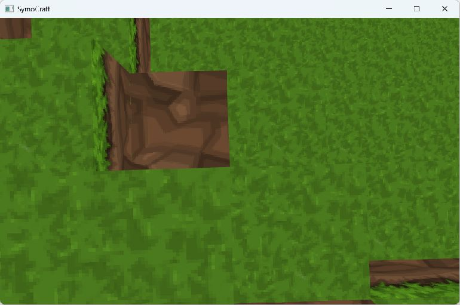

# M0 环境与原始构建报告

日期：2026-09-17。状态：**本节点已由用户验收通过，已获准进入 M1。** 以下环境与实验内容保留 M0 时的历史记录，后续结果见 [M1 报告](../m1/README.md)。

源码基线：`b404edcc432f68ab05634637d0ed284dfe145db9`，提交说明 `Fix memory leaks`。开始时工作区干净。M0 未修改游戏源码、资产、顶层 CMake 或第三方依赖；仅新增文档、诊断脚本与证据。构建产物位于原有忽略规则覆盖的 `cmake-build-debug/` 下。

## 结论摘要

1. **原始源码可以编译。** 选定已安装的 MSVC 2022 x64 后，Debug 和 Release 的 `SymoCraft` 目标均从新构建目录生成成功。
2. **启动依赖当前工作目录。** 同一 Debug 可执行文件从自身目录启动，约 7.2 秒后以退出码 3 结束；从能解析 `../assets` 的目录启动，可以显示有纹理的世界。失败的精确异常栈尚未取得，不把资源路径关联直接写成已确认的唯一根因。
3. **原始 Release 能显示世界并响应 Esc 正常退出。** 本次退出码为 0；这不证明底层资源释放顺序正确，也不代表完成全部玩法验收。
4. **没有可用的项目自动测试基线和性能基线。** CTest 列表为 0 个测试；尚未测量帧时间、GPU 时间或参考笔记本表现。
5. 后续重点应是构建可重复性、CLion 接入、运行资源定位、生命周期和边界正确性，而不是盲目重写整个项目。

范围与阶段约定见 [项目范围](../../project-scope.md)；现状数据流见 [架构说明](../../architecture/current-data-flow.md)。

## 环境记录

| 项目 | 本次观察 |
| --- | --- |
| 系统 | Windows 11 专业版，64 位，版本 10.0.26200 |
| CPU | AMD Ryzen 7 9700X，8 核 / 16 线程 |
| 内存 | 用户安装配置 64 GB；系统可见物理内存 66,190,954,496 bytes |
| NVIDIA GPU | GeForce RTX 5070 Ti；`nvidia-smi` 报告驱动 616.64、显存总量 16,303 MiB |
| 其他显示设备 | 同机有 AMD 核显和虚拟显示设备，因此不能只凭 GPU 清单认定游戏使用了哪张显卡 |
| CLion | 2026.2.1，build 262.9437.136 |
| CMake | CLion 随附 4.3.1 |
| Ninja | CLion 随附 1.13.2，已确认可执行；本轮没有采用 Ninja 构建 |
| Visual Studio | Community 2022，17.14.24，安装完整 |
| 可用 MSVC 目录 | 14.38.33130、14.44.35207 |
| **实际构建编译器** | **MSVC 19.38.33145.0，工具集目录 14.38.33130，目标 x64** |
| SDK | Windows SDK 10.0.22621.0 |
| 生成器 | `Visual Studio 17 2022`，平台 `x64`，显式选择完整 VS2022 实例 |
| 程序日志中的 OpenGL | GLAD 检测的版本为 4.6；未输出 GL_VENDOR / GL_RENDERER，实际渲染设备未记录 |

普通 PowerShell 的 PATH 未找到 cmake、ninja 或 cl，但工具实际已安装。不能将这一现象记作缺少开发环境。

另发现一套 VS2026 安装记录，状态为不完整、不可启动；本轮没有使用或修复该安装。VS2022 的通用默认版本文件指向 14.44，而 v143 默认版本文件指向 14.38。本次 CMake 日志与编译器文件均确认实际用了 14.38，不将 `dumpbin` 的 14.44 版本误写成编译器版本。

本轮使用 CLion 随附 CMake 配合 VS 生成器，是为了在不依赖已打开 IDE 配置的情况下取得原始构建基线。**CLion 工程导入、Ninja + MSVC 配置与 IDE 内运行仍留给 M1 验收。**

## 构建实验

| 实验 | 结果 | 证据 |
| --- | --- | --- |
| 初次沙箱内配置 | 失败：MSBuild 读取用户 Windows SDK 目录被拒绝；属于执行环境权限问题 | [01 配置原始日志](evidence/01-original-configure.log) |
| 经授权在新目录重试配置 | 成功，识别 MSVC、Windows SDK 和 GLFW Win32 后端 | [02 配置日志](evidence/02-original-configure-host.log) |
| 原始 Debug 游戏目标 | 成功，退出码 0；22 条 C4819 字符编码警告，无编译/链接错误 | [03 Debug 日志](evidence/03-original-build-debug.log) |
| 原始 Release 游戏目标 | 成功，退出码 0；22 条同类警告，无编译/链接错误 | [04 Release 日志](evidence/04-original-build-release.log) |
| 已注册测试列表 | 0 个测试；这不是“测试全部通过” | [09 测试清单](evidence/09-test-inventory.log) |

首次配置目录为 `cmake-build-debug/m0-original`；授权重试使用另一个全新目录 `cmake-build-debug/m0-original-host`，没有借用旧工程缓存或修改源码绕过错误。

配置日志中的 pthread 探测失败后成功找到 Windows 线程支持，以及找不到可选 Doxygen，均没有阻止生成。第一份日志保留了 MSBuild 子进程中文编码显示异常，不重写原始证据。

仅构建 `SymoCraft` 及它的依赖，没有声称 GLFW 默认开启的全部示例和自测目标也已验证。没有安装或下载额外软件。

## 启动实验

| 实验 | 工作目录 | 实际结果 |
| --- | --- | --- |
| 05 Debug，程序自身目录 | `cmake-build-debug/m0-original-host/Debug` | 出现过 SymoCraft 窗口；自然结束，退出码 3，观测时长 7.198 秒；未取得可用 stdout/stderr 文本 |
| 06 Debug，资源路径正确目录 | `cmake-build-debug` | 观测到有纹理的世界；持续到 45 秒观测上限后由诊断脚本终止，不是记录到自然崩溃或正常退出 |
| 07 Release，资源路径正确目录 | `cmake-build-debug` | 观测到有纹理的世界和 shader 编译成功日志；发送 Esc 后自然退出，退出码 0，观测时长 48.323 秒 |

工作目录为 `cmake-build-debug` 时，程序中的 `../assets` 正好解析到项目资源目录。以程序自身目录启动时，该路径不指向项目资源目录。这个差异是后续资源定位修复的直接复现条件。

证据：

- 实验 05：[过程记录](evidence/05-debug-start-exe-directory.json)、[stdout](evidence/05-debug-start-exe-directory.stdout.log)、[stderr](evidence/05-debug-start-exe-directory.stderr.log)。两份文本日志为空，这是实际采集结果，不代表没有发生异常。
- 实验 06：[过程记录](evidence/06-debug-start-resource-directory.json)、[stdout](evidence/06-debug-start-resource-directory.stdout.log)、[stderr](evidence/06-debug-start-resource-directory.stderr.log)、[世界截图](evidence/06-debug-world.png)。
- 实验 07：[过程记录](evidence/07-release-start-resource-directory.json)、[stdout](evidence/07-release-start-resource-directory.stdout.log)、[stderr](evidence/07-release-start-resource-directory.stderr.log)、[世界截图](evidence/07-release-world.png)。



本图仅证明捕获时有实际几何和纹理画面，不是画质或玩法验收。没有执行完整移动、碰撞、编辑、窗口恢复和重启用例。前台输入没有被录制为确定性回放，日志里的方块移除信息也不作为完整交互测试通过的依据。

实验 06、07 采样到的进程峰值工作集分别约为 1.36 GiB 和 0.42 GiB。它们对应不同随机世界、不同构建和短时间观察，**不是内存预算，不是泄漏判断，也不能直接用于优化对比**。进程工作集也不是 GPU 显存占用。

`elapsedSeconds` 是整个观测到进程退出/停止的时间，不是“首次可操作时间”。本轮窗口由原程序按显示器尺寸决定，没有执行 1080p 基准。所有本轮启动的游戏进程均已结束。

## 原始构建产物

这些是调查用构建产物，**不是通过 M2/M6 的独立游戏发布包**。

| 配置 | 相对项目根路径 | SHA256 |
| --- | --- | --- |
| Debug | `cmake-build-debug/m0-original-host/Debug/SymoCraft.exe` | `63764FE346E006C56844DDAAD5FF0F204E9AB9EAA75F08FB598235972DCB646B` |
| Release | `cmake-build-debug/m0-original-host/Release/SymoCraft.exe` | `79057FEA62F8412CF3059296C972F73983224E88EAE91A1F33F8509C10B5117B` |

[二进制依赖检查](evidence/08-executable-dependencies.log)显示 Debug 依赖调试版 MSVC 运行库，Release 依赖 MSVC/UCRT 运行库。当前构建目录没有复制 `assets`，也没有独立发布/运行库部署流程。

尽管 CMake 显式链接并复制 irrKlang，两个最终 exe 的静态导入表没有列出 irrKlang.dll，与目前没有有效音频调用的源码状态一致。不能据此推定将来启用音频后仍然不需要该 DLL；详细清单见 [依赖盘点](../../third-party-inventory.md)。

## 问题与处置顺序

| ID | 证据等级 | 问题 | 建议阶段及验收 |
| --- | --- | --- | --- |
| M0-01 | 已复现 | 程序目录启动异常，正确资源目录可显示世界；尚缺失败异常栈 | M1/M2：规范资源布局与定位，明确失败传播；不同工作目录启动复测 |
| M0-02 | 已验证缺口 | 缺少项目构建预设、CLion 接入验收和独立运行包；目前靠本机完整路径复现 | M1：明确工具链和目标级配置，干净目录双配置构建及 CLion 内验证；M2：首个运行包 |
| M0-03 | 静态事实，影响待复现 | Init 失败仍继续 Run；退出先销毁 GL 上下文再释放 shader | M2：失败路径和释放顺序修复；错误日志、退出及资源检查 |
| M0-04 | 静态事实，影响待复现 | mesh 的 uint16 计数、容量检查和 realloc 返回值处理存在缺口；Batch 步长/容量契约不完整 | M2 优先处理内存安全：高暴露面与批次边界测试；不以普通地形能运行放行 |
| M0-05 | 静态事实，影响待复现 | 跨区块植被生成顺序和边界索引需核对；首帧计时包含生成时间且物理补步无上限 | M2：交界、高度边界、出生、长帧和窗口恢复用例 |
| M0-06 | 已验证缺口 | 顶层 CTest 列表为空 | M1 明确测试接入方式；M2 对修复补重点回归，M3 建立可无窗口测试的核心逻辑 |
| M0-07 | 静态事实，性能影响未测 | 每帧重新上传有效区块网格；记录的 seed 不能完整重放世界 | M2 建初始测量与可重复场景；M4 再按 CPU/GPU 数据优化 |
| M0-08 | 已验证清单缺口 | 若干依赖来源/许可材料不完整，存在未使用二进制和重复头文件 | M1 明确实际依赖；发布前补齐材料，不在 M0 全量升级或删除 |
| M0-09 | 已复现警告 | robin_hood 头产生 C4819 编码警告 | M1 统一项目编码策略，区分第三方警告与项目警告，不用全局关闭警告掩盖问题 |

更详细的静态证据和源码位置见 [当前架构风险表](../../architecture/current-data-flow.md#m1--m2-重点风险)。目前未启用的线程池不列为已经发生的运行故障；M0 不决定重写 ECS 或启用并发。

## 复现本次基线

以下为本机 PowerShell 命令，工作目录是项目根目录。`m0-repro` 是供复核使用的新目录；存在时应另取新名称，不删除用户已有目录。路径是环境记录，后续 M1 应用可移植配置替代本机硬编码说明。

```powershell
$cmake = 'E:\Applications\JetBrains\CLion\bin\cmake\win\x64\bin\cmake.exe'

& $cmake -S . -B cmake-build-debug/m0-repro `
    -G 'Visual Studio 17 2022' -A x64 `
    '-DCMAKE_GENERATOR_INSTANCE=E:/Applications/Microsoft VS/2022' `
    -T 'v143,version=14.38.33130'

& $cmake --build cmake-build-debug/m0-repro --config Debug --target SymoCraft --parallel 8
& $cmake --build cmake-build-debug/m0-repro --config Release --target SymoCraft --parallel 8
```

原始实验没有传 `-T`，由该机器 v143 默认值选择了 14.38；复核命令显式固定同版本以避免日后默认值变化。构建日志记录的退出码、工具选择和编译结果优先于目录名称。

启动探针只做有界观测，不修改游戏。它会重定向 stdout/stderr、记录退出状态，并在到达观察上限后停止自己创建的进程。记录名不能重复，避免覆盖已有证据；脚本正常完成的退出码不等于游戏退出码，应读取 JSON 中的 `naturalExitCode` 和 `forcedStopAtObservationLimit`。

```powershell
& ./docs/milestones/m0/Probe-Startup.ps1 `
    -Executable ./cmake-build-debug/m0-repro/Release/SymoCraft.exe `
    -WorkingDirectory ./cmake-build-debug `
    -EvidenceName repro-release-start -ObserveSeconds 60
```

在一般本地开发环境中不要求以管理员身份构建。此次授权重试是为了离开代理沙箱访问已安装 SDK，不是修改系统权限或把管理员权限写成工程要求。

## 本节点验收与未执行项

- [x] 明确范围、参考硬件、阶段门槛和文档标准。
- [x] 核实已有工具链，区分安装缺失与 PATH / 沙箱问题。
- [x] 原始源码在全新目录完成 Debug / Release 游戏目标构建，保留日志。
- [x] 记录不同工作目录的启动差异、实际世界画面和一次 Release Esc 退出结果。
- [x] 完成当前数据流、依赖、静态风险和后续玩法检查表。
- [x] 不修改游戏源码、资产或构建配置，不留下测试游戏进程。
- [ ] 用户确认 M0 验收并授权进入 M1。

未执行：CLion 内工程导入/运行、Ninja 构建、全部默认第三方目标构建、完整 M2 玩法表、15/60 分钟稳定性、内存检测器/GL 调试验收、参考笔记本运行、可重复帧时间与 GPU 基准、无开发环境机器上的发布包验证。

建议 M1 范围：先建立可重复的 CLion + MSVC + CMake 构建入口、目标级依赖及编码策略，明确资产复制/运行目录和测试接入；不同时全量升级依赖或重写核心玩法。内存安全、资源生命周期及玩法修复继续按 M2 门槛验证。
