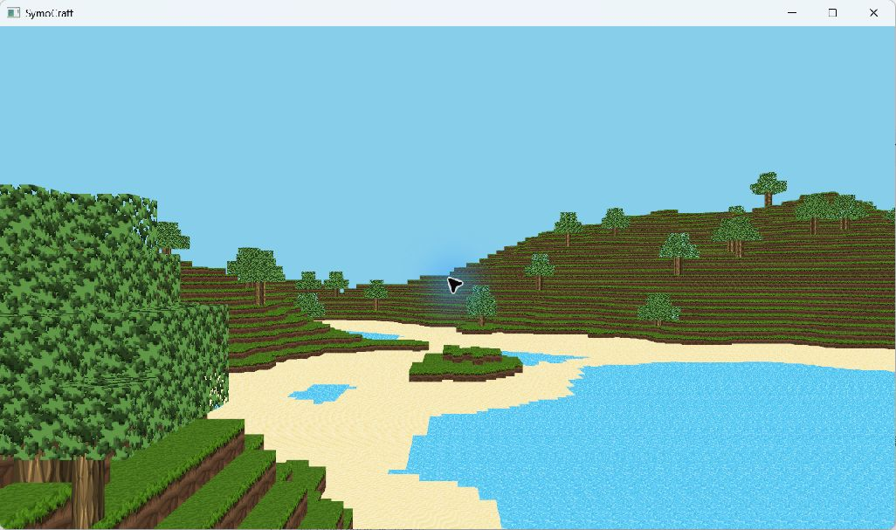

# M2-A 桌面阶段报告

日期：2026-09-17。状态：**实现、桌面局部验证与候选包已交付，待用户人工验收；M2 整体未通过。** 本轮不操作 CLion，不新增动态区块加载、多线程架构或玩法系统。

## 交付结论

| 项目 | 结果与边界 |
| --- | --- |
| Debug / Release 编译 | 两个独立目录构建成功；最终增量构建包含按键修复 |
| 自动测试 | Debug、Release 各 9/9 通过，范围见下表 |
| 真实 Debug 渲染 | 最终版本生成 441 区块，准确运行 120 帧，退出码 0，未超时，GL 诊断计数 0 |
| Release 画面与交互 | 局部观察到地形、纹理、选择框、拆放；安装版观察到材料切换、一次起跳落地及短距离移动，不等于完整玩法通过 |
| 资源损坏 | 隔离副本中的坏 shader、坏 PNG、空 YAML 均在 ready 前报错，退出码 3，完成清理；原资源哈希未变 |
| 安装与退出 | 安装版从无关工作目录运行，最后一次探针记录退出码 0、未超时及完整清理标记 |
| 人工验收 | 待用户确认持续移动、奔跑、碰撞、编辑和退出体验；完整 14 项及 15 分钟游玩未验收 |
| 性能与笔记本 | 尚未建立性能基线；指定 Y9000P 已列入 M2 必验范围，尚未执行 |

本阶段修复了阻挡可靠运行和局部可玩的具体缺陷，但不以这些结果宣称“工程级架构与性能已达标”。M3/M4 的结构与性能工作仍需独立交付。

## 使用候选版

- 本机安装目录：`out/install/m2-a`，入口为 `SymoCraft.exe`。
- 压缩包：`out/packages/Symocraft-M2-A-windows-x64.zip`，解压后包含完整 `m2-a` 目录。
- 游戏说明：[PLAYER-README.zh-CN.md](PLAYER-README.zh-CN.md)，随包附带。
- 版本标识：[build-identity.json](evidence/build-identity.json)；包内容与哈希见 [manifest.json](evidence/package/manifest.json)，归档校验见 [archive-verification.json](evidence/package/archive-verification.json)。

本次 exe SHA256 为 `6F2F5EC44715D0ED8EC6EFD899EE9C9F28E9993D8EFE202507C42B8B64D09B17`；安装版与最终 Release 构建版相同。源码基线是 `00640dcdae55353c006edaf22c40ad2fea457f79` 加本轮未提交改动，**不能把基线提交单独视为本包源码**。构建输入的逐文件哈希另行记录，未代用户提交 Git。

包是开发验收候选版，而非免安装依赖的最终发行版。真实游戏暂使用 ASCII 路径。静态导入表包含 MSVC/UCRT 运行库，包中未捆绑运行库安装程序；无开发环境机器上的部署与第三方许可材料整理仍待发布阶段。见 [当前依赖检查](evidence/build/m2-a-release-dependencies.log) 和 [依赖盘点](../../third-party-inventory.md)。

## 环境与范围

| 字段 | 本轮记录 |
| --- | --- |
| 主机 | Windows x64，Ryzen 7 9700X、RTX 5070 Ti、64 GB；硬件基线沿用 M0 |
| 实际 GL 设备 | NVIDIA GeForce RTX 5070 Ti/PCIe/SSE2，OpenGL 4.6.0 NVIDIA 616.64 |
| 工具链 | CLion 自带 CMake 4.3.1 / Ninja 1.13.2；VS2022 MSVC 19.38.33145 x64 |
| 构建目录 | `out/m2-a/debug`、`out/m2-a/release`，不替换 CLion 的默认构建目录 |
| 世界与渲染 | 441 个固定区块；外围一圈不绘制，最多 361 个区块进入绘制；VSync 开启 |
| 窗口 | 普通窗口；日志显示显示器 2560x1440，未记录独立 framebuffer 分辨率样本，不能当作 1080p 性能试验 |
| 输入 | 使用英文输入模式复测；初期曾有输入法组合窗口与短按无响应，不能据此单因归咎某一代码问题 |
| 场景重放 | 未实现完整固定 seed 重放，各次随机世界不是同一性能场景 |

本轮日志内的旧日志器时钟与文件时间不作为跨工具精确计时依据；探针经过时间只使用进程墙钟计时。程序 `loading_ms` 只包含纹理加载、世界和初始 CPU 网格准备，不包含整个初始化、首帧 GPU 上传与呈现。

## 实施内容

1. **启动与清理**：明确窗口、相机、注册表所有权，部分初始化失败可清理；纹理、shader 和批次在 GL 上下文销毁前释放；异常诊断与退出码明确。
2. **区块与批次**：区块不再浅复制；方块/网格使用拥有内存的容器；扩大顶点计数类型；邻居/高度边界与批次容量检查；顺序生成全部地形再生成植被。
3. **玩家与交互**：组件零初始化，初始出生点检查；加载时间不计入物理；固定步长及追赶上限；模拟后同步相机；体素射线和放置碰撞约束；跌出有限世界后恢复。
4. **输入与显示**：按键粘滞模式配合全量快照，避免短路遗留旧输入；失焦恢复清状态；修复选择框顶点和变换；正确处理窗口 framebuffer 调整。
5. **资源内容**：shader/图片加载失败明确中止；方块 YAML 分阶段校验，保留现有固定 ID 兼容；检查纹理层索引。
6. **验证工具**：有限帧真实运行入口、普通运行探针、三类隔离资源故障探针，以及五项新增局部测试。

技术说明包含职责、数据流、所有权、算法、测试和限制：

- [应用生命周期与验证](../../architecture/application-lifecycle.md)
- [运行期图形资源](../../architecture/runtime-resources.md)
- [网格与批次内存安全](../../architecture/mesh-safety.md)
- [玩家循环与输入](../../architecture/player-loop.md)

这些修改没有替换整个 ECS、引入新的线程池，或实现持久 GPU 区块网格；每帧全世界几何装入和上传仍是后续需测量的成本。

## 自动与运行证据

### 编译与局部测试

最终记录：[Debug 9 项](evidence/build/m2-a-debug-input-tests.log)、[Release 9 项](evidence/build/m2-a-release-input-tests.log)。首次完整构建日志也保留在 `evidence/build`；警告未被统一屏蔽，包括旧分配器/日志器和噪声浮点转换相关警告。构建通过不等于零警告或自研基础模块已完成审计。

| 测试 | 检查范围 |
| --- | --- |
| `assets.contracts` | 资源路径契约及隔离子进程 |
| `assets.from_source_directory` | 源码工作目录下同组契约 |
| `assets.game_preflight` | 真实 exe 的无窗口资源预检 |
| `assets.game_package` | 迁移资源包、缺失资源、参数错误，不初始化图形 |
| `player.math` | 移动向量、体素射线、AABB 放置等局部算法，不是完整物理场景 |
| `renderer.batch_safety` | 使用 GL 函数替身检查批次边界、计数及释放，不等于驱动测试 |
| `world.mesh_safety` | 真实区块网格逻辑、大于 65535 顶点、邻居边界和清理；渲染接口用替身 |
| `world.block_config` | 有效配置、错误配置、纹理层范围与失败后保留旧状态 |
| `input.key_snapshot` | 全控制键仅采样一次、粘滞消费与快照重复读取；不替代原生窗口焦点验收 |

### 实际运行

| 记录 | 观察与结论 |
| --- | --- |
| [debug-120](evidence/debug-120/result.json) | 较早版本 120 帧正常完成，历史记录保留，不替代最终复测 |
| [debug-final-120](evidence/debug-final-120/result.json) | 含最终按键修复；准确 120 帧，0 GL 诊断，退出码 0；[原始日志](evidence/debug-final-120/stdout.log) |
| [release-interactive](evidence/release-interactive/result.json) | 约 202 秒的早期局部交互；有拆除/放置截图，最终正常退出；不等于 15 分钟连续玩法 |
| [release-input-retest](evidence/release-input-retest/probe-note.md) | 安装版记录材料切换、起跳落地及位置从 `(0.5,95.95,0.5)` 到 `(0.5,95.9,0.353333)`，游戏清理标记为 0；但旧探针在读取空 stderr 后失败，没有 JSON，通过记录不补造 |
| [release-final-exit](evidence/release-final-exit/result.json) | 修复探针后安装版正常退出，7500 帧、106.164 秒，未超时；电脑自动操作被用户 Esc 停止后仅等待进程结束，不能据此宣称自动 Esc 或关闭按钮完整验收通过 |
| [debug-faults](evidence/debug-faults/summary.json) | 坏顶点 shader、不可解码 PNG、空 YAML 均预期失败：exit 3、未 ready、shutdown 完成、相应错误存在、原资源哈希一致 |

Release 默认没有启用 Debug GL 回调；其 JSON 的零诊断计数只说明未记录该类文本，不能证明进行了与 Debug 相同强度的 GL 错误检查。Debug 最终运行的零诊断也只是本轮观测，不是无驱动错误或无资源泄漏的穷尽证明。

部分画面证据：



拆放对照：[原方块](evidence/release-interactive/01-initial.png)、[拆除后](evidence/release-interactive/02-removed.png)、[放置后](evidence/release-interactive/03-placed.png)。跳跃只保留了离散截图，不可代替动作全程录像或接触边界回归。

## 失败、修复与尚待验证

- 初轮键盘响应不能稳定确认，后来观察到输入法组合窗口。代码同时存在逐帧轮询漏掉同一事件轮询中按下/释放的风险，现以粘滞键和完整快照修复，英文模式下已观察到局部响应。无法证明初次现象只由其中一种因素引起。
- 探针读取空错误日志后报空值方法错误，游戏本身当轮正常清理；已修复并另行复验，旧日志与失败说明保留。
- 电脑操作被用户停止时立即停止继续发送输入；最后仅收集已有进程退出结果，不把中断变成完整 UI 用例通过。
- 极短移动输入可能落在没有固定物理步的渲染帧，尚未构建输入历史消费系统；持续移动、墙角、低顶、单块落地及调试模式恢复仍需完整人工检查。
- 区块外围、高度和批次溢出有局部保护及测试，但全部边界玩法、显卡能力不足、显存耗尽、驱动挂起等未逐项实机注入。
- 当前没有完整材料 HUD、存档、流式世界；水/树叶等资源虽在场景可见，未逐纹理逐角度完成显示验收，不因本轮显示正常而宣称透明排序正确。
- 未进行 15 分钟连续游玩、60 分钟稳定性、逐帧统计、CPU/GPU 分解、内存/显存趋势或性能达标判断。

## 验收与后续节点

用户可先按随包说明执行短人工检查，确认当前版本确实可供继续游玩；有阻断问题则继续留在 M2-A 修复，不以“后续优化”放行。

M2 后续必须补齐 [玩法用例](../../testing/gameplay-smoke.md) 中的完整结果、资源显示检查、可重复场景和初始性能数据。正式笔记本验收使用 Y9000P / i7-12700H / RTX 3070 Ti Laptop / 32 GB，记录接电、性能/显卡模式、驱动、实际 GL 设备、分辨率、VSync、场景和温度条件；台式机结果不得替代它。

本阶段没有冻结新的性能预算，也没有把各次进程时长除以帧数作为 FPS。只有在场景和采集边界一致之后，才比较原始帧时间、P95/P99、加载、网格重建、上传、内存与显存等指标。

## 复现入口

下面命令从源码根目录运行。工具路径替换为本机实际 CLion 位置；运行探针会创建游戏窗口，必须在允许使用桌面时执行。输出证据目录必须是新的。

```powershell
./scripts/build.ps1 -Configuration Debug -Action Test -CLionPath 'E:/Applications/JetBrains/CLion' -BuildDirectory out/m2-a/debug
./scripts/build.ps1 -Configuration Release -Action Test -CLionPath 'E:/Applications/JetBrains/CLion' -BuildDirectory out/m2-a/release
cmake --install out/m2-a/release --prefix out/install/m2-a
./scripts/verify-runtime.ps1 -Executable out/m2-a/debug/bin/SymoCraft.exe -OutputDirectory out/evidence/debug-new -Frames 120
./scripts/verify-runtime-faults.ps1 -Executable out/m2-a/debug/bin/SymoCraft.exe -OutputDirectory out/evidence/faults-new
```

源码和证据归 Git 管理；构建目录、安装目录、压缩包与探针运行副本保留在已忽略的 `out`，不要把其二进制产物加入源码提交。重新构建将改变候选身份，必须重新生成清单并补跑受影响验证，不能沿用本报告的 exe 哈希。
